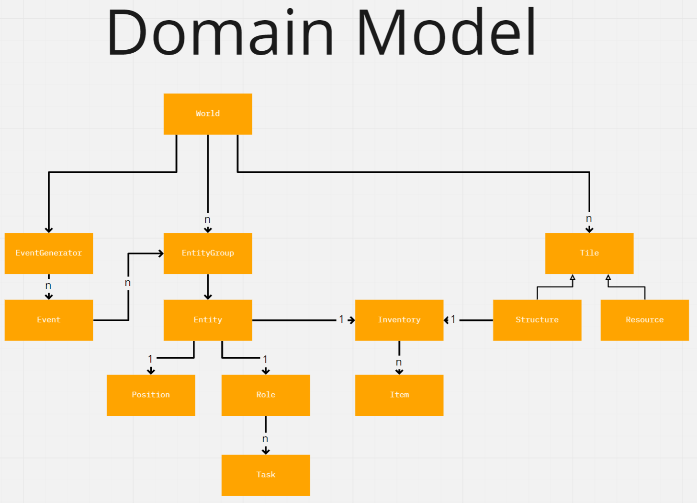

# Meeting Agenda
Group: OOPP-WITH-THE-BOIS

Date: 2021-09-10

Chair: Mathias

Participants: Martin, Jonathan, Jacob, Mathias

## Objectives 
* Decide on project leader with veto rights
* Create project boilerplate
* Set up Maven and Travis

## Reports 
Each member came up with a design suggestion for how to solve the double-dependency problem between enemies and pawns in the domain model, which arose last meeting.

## Discussion items 
1. At what level do we create class-diagrams collaboratively?
1. Should boilerplate contain interfaces?
1. Should we use LibGDX or JavaFX?
1. What is our Definition of Done?
1. RAD Definitions and terminology
1. What will we use Maven for?
1. What will we use Travis for?
1. Commit message style (this commit will [x], punctuation, descriptions)
1. Unit test style (AAA, theories, AssertJ, single reason to fail)
1. Should the DoD include creation class-diagrams?

## Outcomes and assignments 
1. Class diagrams will be stored in each package (as a readme.md) and created by whomever implements the user story in that package. A class diagram will be created from the domain model containing interfaces and classes for the first expansion.
1. Yes, the boilerplate will contain interfaces from the first expansion.
1. We will use LibGDX for our project, because LibGDX is more suited for game development compared to Java.
1.  Definition of Done.  
    1. Completed all Tasks of the User Story.
    1. The Tasks should have tests and they should all pass.
    1. A Pull Request should have been created, reviewed, and merged. 
1. Terminology written in a separate document for RAD and SDD.
1. Maven will build the project and manage dependencies.
1. Travis will automatically run tests and make sure the project compiles.
1. Commit rules:
    1. Title of commits should be in the format: this commit will... “x”. E.g `git commit -m "Add pathfinding"`
    2. Limit the subject line to 50 characters
    3. Wrap the body at 72 characters
    4. Pull requests shall contain a description of the changes within
    5. If a commit needs to be justified, give a reason for the change in the description
    6. Capitalize first letter of subject line, use no punctuation at the end
    7. Rather more, smaller commits than fewer big commits (atomic commits)
    8. Commits submitted in a Pull Request should contain finished work and be properly titled
2. Unit Test style:
    1. If given the choice, write testable code rather than code that can’t be tested
    2. "// Arrange // Act // Assert" test structure
    3. Use [Theories](https://www.arhohuttunen.com/junit-5-parameterized-tests/) when needed, instead of multiple tests
    4. Use [AssertJ](https://assertj.github.io/doc/) library for all assertions
    5. A single test should only be concerned with testing one thing

### Created a UML domain model
The suggestions of each member were combined to create a final domain model diagram.

* Chosen Jonathan as project leader, to settle disagreements faster

* Begun work on class diagram for first expansion

## Wrap up
* Create individual sketches of the gameplay. 
* Next meeting on Tuesday 09:00
