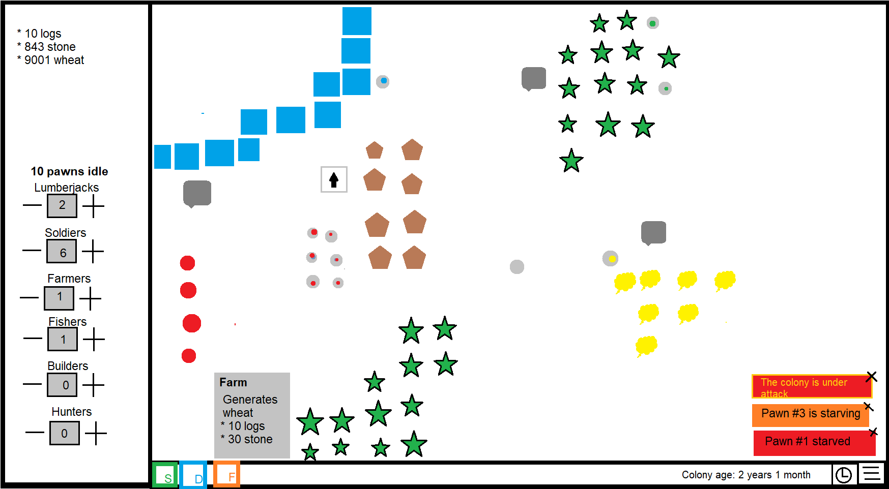

# Meeting Agenda
Group: OOPP-WITH-THE-BOIS

Date: 2021-09-14

Chair: Martin

Participants: Martin, Jonathan, Jacob, Mathias

## Objectives 
* Create project boilerplate
    * Finish class-diagram (design model) of first Expansion
    * Create Java/IntelliJ .gitignore
    * Set up Maven (e.g. com.thebois)
    * Set up Travis
    * Set up [JUnit 5](https://junit.org/junit5/docs/current/user-guide/#dependency-metadata)
    * Add dependency to [AssertJ](https://mvnrepository.com/artifact/org.assertj/assertj-core)
    * Add dependency to [Mockito](https://site.mockito.org/)
    * Create root [LibGDX-project](https://mvnrepository.com/artifact/com.badlogicgames.gdx)
    * Configure checkstyle.xml and IDEA formatter (import checkstyle.xml) 
    * Create common interfaces based on design model
* Set Story Points
* Assign User Stories
* Create proof-of-concept for Friday

## Reports 
All members created a sketch of what the final game should look like. The sketches were presented and discussed. 

One of the sketches:

## Discussion items 
1. Sketches
1. Should the DoD include creation of class-diagrams in package readme.md?
1. [Better example of JUnit Theories](https://www.arhohuttunen.com/junit-5-parameterized-tests/#do-you-need-multiple-arguments)
1. [Java modules](https://www.oracle.com/se/corporate/features/understanding-java-9-modules.html) to force encapsulation?

## Outcomes and assignments 
1. The sketch can be used to complement the prototype on Friday to show what has been done.
1. Add to DoD:
    1. A UML class diagram of the newly implemented user story should be done and included in the readme.md of the parent package.
1. Modules will not be used for the prototype, but will be evaluated later on and the existing code will be refactored to use it if it is deemed better than using simple packages.
2. Not for the proof-of-concept sprint, but will take a look at adopting it later on.

* At the end of the project, we can create a package diagram showing how the different packages relate to each other.

### Boilerplate
* We will all use [OpenJDK 15.0.2](https://jdk.java.net/archive/)
* Edit checkstyle.xml using [checkstyle documentation](https://checkstyle.org/), if encountering a style check error that shouldn’t be there, discuss it and then remove it.
* We now have got a running example LibGDX project working.

## Wrap up
* Create common interfaces based on design model
* Set Story Points
* Assign User Stories
* Create proof-of-concept for Friday
* Next meeting on Friday 09:00
