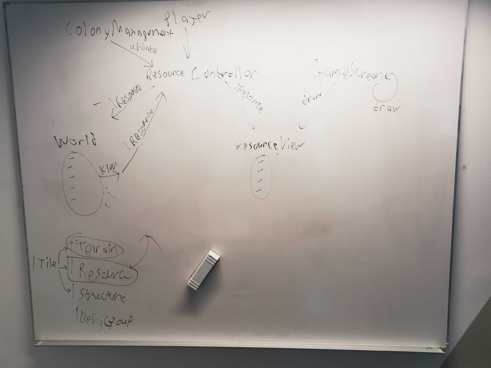

# Meeting Agenda
Group: OOPP-WITH-THE-BOIS

Date: 2021-09-17

Chair: Jonathan

Participants: Martin, Jonathan, Jacob, Mathias

## Objectives 
* Create project boilerplate
    * Create common interfaces based on design model
* Set Story Points
* Assign User Stories
* Create proof-of-concept for Friday

## Reports 
* The team completed the boilerplate together.
* The team assigned user stories and story points for proof-of-concept.
* All group members were assigned a user story and started working on their own user stories.
* Jonathan finished the first draft of basic-world user story. 

## Discussion items 
1. Is proof-of-concept ready?
1. How to upload meeting protocols
1. How to perform a code review on a pull request (use 7 basic world and protocols)
1. LibGDX integration into MVC pattern

## Outcomes and assignments 
1. While some user stories are almost complete, but proof-of-concept is not ready.
1. All team members now feel comfortable with using git terminal. 
1. All team members know how to perform a pull request and a review.
1. See picture below for how we will integrate libGDX into MVC.
1. We finished all common interfaces for the boilerplate.
1. All stories now have story points.
1. All team members have been assigned a user story.
1. proof-of-concept is still in progress. But there is a demo for the game.

## Wrap up
* Finish proof-of-concept for next meeting. Create UML for World and add it to github.
* Next meeting on Tuesday 09:00
