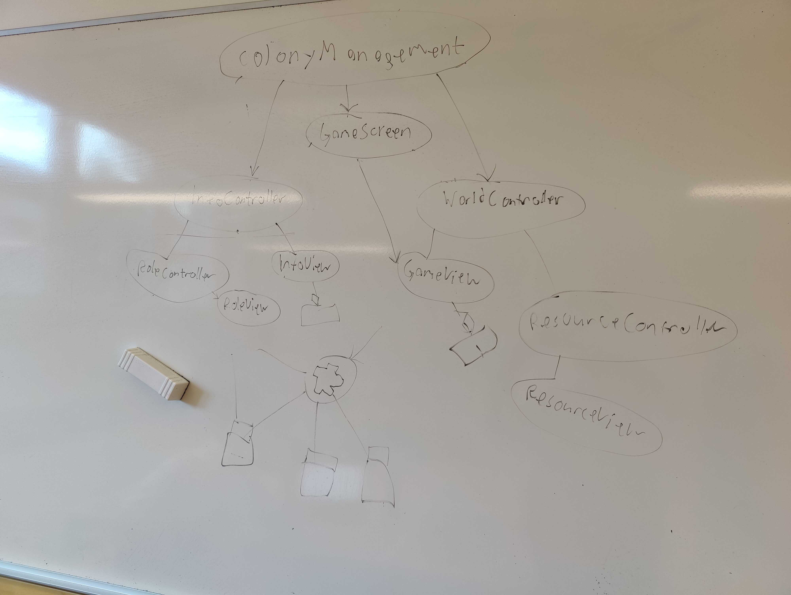

# Meeting Agenda
Group: OOPP-WITH-THE-BOIS

Date: 2021-09-28

Chair: Martin

Participants: Martin, Jonathan, Jacob, Mathias

## Objectives 
* Decide who should write what in SDD and RAD.

## Reports 
All members have continued work on their assigned User Stories.

Two PRs of completed user stories have been created, one for 10-colony-shared-inventory by Jonathan and one for 13-pawn-pathfinding by Martin.

## Discussion items 
1. Start annotating PR comments with tags? (style, question, design, architecture, DRY, etc.)
1. Whoever is chair on Friday meetings should create a protocol PR into master every week.
1. Should we spend this coming Friday ironing out and creating issues for the remaining user stories?
1. How to refactor views and controller structure.

## Outcomes and assignments 
1. We’ll start annotating using “style”, “question” and the rest don’t need a tag.
1. The ones pushing the protocols on Fridays (Jonathan and Mathias) will also create PRs into master.
1. On Friday we’ll create more user stories and check that the already existing stories make sense. 
1. A new way of organizing views and controllers has been created, see image below:

### New rendering architecture

### SDD and RAD
Parts of the documents have been assigned to each group member. The RAD will be completed this Friday or next Tuesday, and a first draft of the SDD will also be created.

Once they are completed, we have two active PRs to review, and once they are reviewed, we have standalone tasks that need to be worked on.

## Wrap up
* Change checkstyle to remove the ban on single-letter variable names
* Next meeting on Friday 09:00
