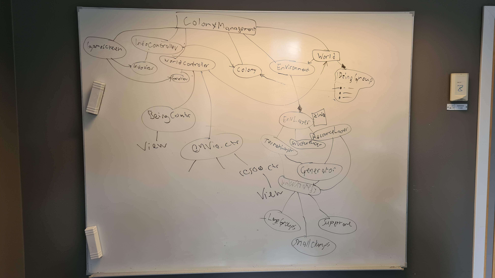

# Meeting Agenda
Group: OOPP-WITH-THE-BOIS

Date: 2021-10-05

Chair: Jacob

Participants: Martin, Jonathan, Jacob, Mathias

## Objectives 
* Change about description on github from swedish to english

## Reports 
* 

## Discussion items 
1. Take another look at World, will it follow SRP after the inventory is factored out?
1. Which class should be responsible for creating and placing pawns?
1. Responsibilities of the class World.
1. How actions and beings interact.

## Outcomes and assignments 
1. Irrelevant methods will be removed and relevant methods will be added and kept to follow SRP.
1. The responsibility of creating beings will be moved to the colony.
1. The different tile matrices will be refactored to exist as a separate class Environment. World will be responsible for handling BeingGroups and the Environment object. The refactor is pictured below:
1. Actions will follow the Visitor design pattern where Beings will pass themselves to the visitor. MoveAction will recalculate its path from the point of the obstruction onward (and keep part of the old path). Needs no reference to actionPerformer.

### Environment Refactor

## Wrap up
* Continue work on SDD, RAD and User Stories.
* Next meeting on Thursday 13:15
